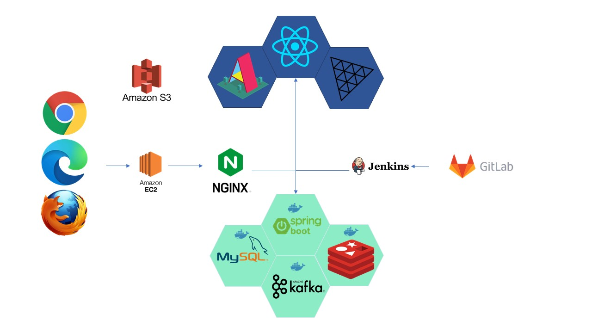
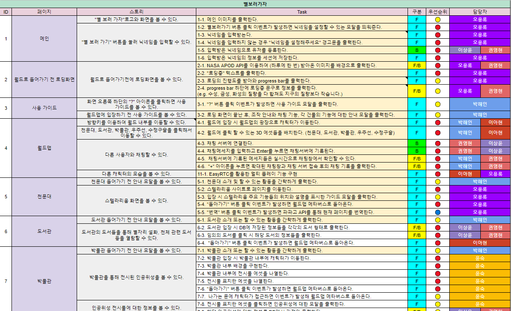
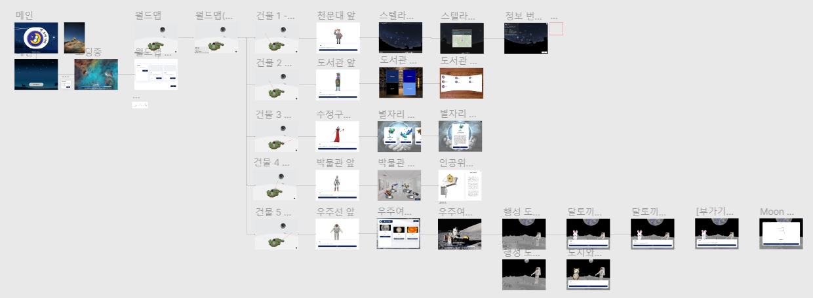
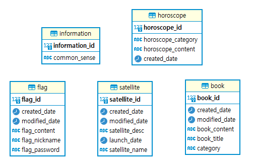

 

# 별 보러 가자

> **천문 체험 메타버스 플랫폼**  
> **프로젝트 기간 : 2022.04.11 ~ 2022.05.20**

 

## 🙆‍♂️ 팀원 소개

|권영현|이상윤|박해인|오용록|윤숙|이아현|
|:-:|:-:|:-:|:-:|:-:|:-:|
|||||||
|Backend|Backend|Frontend|Frontend|Frontend|Frontend|
[@yunghun97](https://github.com/yunghun97)|[@dltkddbs](https://github.com/dltkddbs)|[@haiyinde](https://github.com/haiyinde)|[@ohyr](https://github.com/ohyr)|[@djs02027](https://github.com/djs02027)|[@alskal1](https://github.com/alskal1)|

 

## :pushpin: 프로젝트 소개

  ### 배경

 빛공해와 코로나로 인한 사회적 거리두기의 영향으로 도심에서 벗어나 별을 보러가기란 '하늘의 별따기'가 되었습니다. 저희 팀은 별 그리고 우주에 관심이 있지만 여건이 되지 않아 직접 보러가지 못하는 사람들을 위한 서비스가 필요하다고 느꼈습니다.

`별 보러 가자`는 이러한 사람들을 위한 오픈소스 플라네타리움 스텔라리움, 인공위성 박물관과 허블 헤리티지 갤러리 등을 준비하여 위의 수요를 충족하고자 했습니다. 또한 천문학을 어렵게 느끼는 사람들을 위한 재미 요소로 달 방문 후 깃발 꽂기, 별자리별 오늘의 운세 등의 콘텐츠를 제공하고 있습니다.
  
   ### 타겟🎯

별과 우주에 관심이 있지만 바쁜 사람들

천문학이 어렵게 느껴지는 사람들

  ### 목적🥅

  1. 실제로 별을 보는 것과 같은 입체감을 최대한 전달하자.

> 시공간적 제약을 벗어나면서도 천문학 특유의 입체감을 최대한 제공하고자 하는 것을 목표로 했습니다. 이를 위해 메타버스, WebGL을 기반으로 한 가상 공간을 구축하여 그곳에서 별을 관측하고, 다양한 3D 콘텐츠를 구현했습니다.

2. 게임 요소를 도입하여 천문학을 쉽고 재미있게 풀어보자.

> MZ세대에게는 친숙한 게임형 구조로 기획하여 어렵게 느껴질 수 있는 천문학을 쉽고 재미있게 느껴질 수 있도록 구현했습니다.

 

## 
기술 스택

<b>Backend</b>

 
    

 

<b>Frontend</b>

 
 
 
 

 

<b>Tools</b>

 

## 활용 기술

### 1. A-frame

A-frame은 VR 오픈소스 웹 프레임워크로, Three.js를 기반으로 사용자들이 빠른 시간안에 기초적인 요소를 구현할 수 있도록 기능을 제공합니다. 저희 팀은 실 개발기간 4~5주라는 짧은 기간동안 많은 기능을 구현하기 위해 해당 프레임워크를 선택했습니다.

### 2. Vite

vite는 esbuild 기반으로 webpack보다 100배 정도 빠른 빌드 툴이다. 기본적으로 Native ES 모듈을 지원하기 때문에 빠른 HMR을 지원합니다. ES 모듈로 개발한 것은 따로 빌드하지 않아도, 자바스크립트 코드를 모두 번들할 필요없이, 서버에서 인터프리트하여 웹페이지를 보여주고 있습니다. 별보러가자는 three.js와 aframe을 기반으로하여 일반적인 웹페이지보다 용량이 크기때문에 선택했습니다.

### 3. Kafka

링크드인에서 개발한 오픈소스로 대규모 메시지를 빠르게 처리할 수 있는  분산 스트리밍 메시징 플랫폼으로 클러스터링이 되어있기 때문에 안정적인 아키텍쳐와 좋은 확장성을 가지고 있어 Line, Twiter 등 많은 기업들이 사용하고 있습니다. Kafka를 활용하여 많은 채팅 데이터를 종합하고 이를 컨트롤하기 위해서 Kafka를 사용하고 있습니다.

## 프로젝트 구성

### 서비스 아키텍처

### 시연 영상
https://clipchamp.com/watch/NiLrmS6fPMp

### 요구사항 정의서

> 구글 스프레드 시트를 활용하여 요구사항 정의서를 작성하였습니다. 페이지, 스토리, 태스크 단위로 구분하였고, 우선순위와 담당자를 표기했습니다.

### 와이어프레임

### ERD

## 👨‍💻프로젝트 진행

<h3><a href="https://www.notion.so/haeinpark/SSAFY-be109d4349604666b99b90c74158cd8e">팀 노션</a>　|　<a href="https://www.figma.com/file/gT8h8FPEXTNB7b1F1sRqHK/%EB%B3%84%EB%B3%B4%EB%9F%AC%EA%B0%80%EC%9E%90?node-id=0%3A1"> FIGMA </a>　|　<a href="https://docs.google.com/spreadsheets/d/1pjDT7OodQxBNo8Usj1N_JDam9GTGSz1guHb6KDOD1Sw/edit#gid=0"> 백 로그</a>

